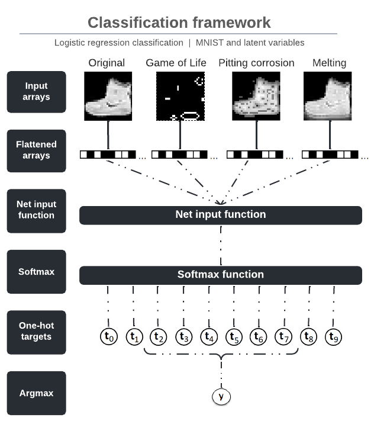

<!-- PROJECT LOGO -->
<br />
<p align="center">
  <a href="https://github.com/emiltj/cds-visual-exam">
    
  </a>
  <h1 align="center">Enhancing Image Classification Using
Cellular Automata Inspired by Natural
Transformation Processes</h1>
 <h1 align="center">Data science exam 2022</h1>

  <p align="center">
    Emil Trenckner Jessen, Jakob Grøhn Damgaard and Johan Kresten Horsmans
    <br />
    <a href="https://github.com/bokajgd/data-science-exam/blob/main/Enhancing_Image_Classification_Using_Cellular_Automata_Inspired_by_Natural_Transformation_Processes.pdf"><strong>Read the paper here»</strong></a>
    <br />
  </p>
</p>

<!-- TABLE OF CONTENTS -->
<details open="open">
  <summary>Table of Contents</summary>
  <ol>
    <li><a href="#about-the-project">About the project</a></li>
    <li><a href="#getting-started">Getting started</a></li>
    <li><a href="#repository-structure">Repository structure</a></li>
    <li><a href="#contact">Contact</a></li>
  </ol>
</details>

<!-- ABOUT THE PROJECT -->
## About the project

<p align="center"></p>
<p align="center"><em>Example image displaying the classification framework of the paper</em>
</p>

**See [here](https://github.com/bokajgd/data-science-exam/blob/main/Enhancing_Image_Classification_Using_Cellular_Automata_Inspired_by_Natural_Transformation_Processes.pdf) for an overview of the entire paper.**

This project contains the exam for the Data Science exam of 2022.

Many recent advances within the field of image classification are coming from the development of various new data augmentation methods which enable ample model training when faced with scarce data resources (Shorten & Khoshgoftaar, 2019). This paper investigates a novel approach to data augmentation in which cellular automata simulations are used as a method to enhance image data distinctiveness. We develop a set of cellular automata rules and apply them to the Fashion-MNIST data set to assess whether it is possible to enhance discriminatory features of the images in a way that will improve the classification performance of a simple multinomial logistic regression model. The rule sets utilized are rooted in natural transformation processes, namely, the Game of Life, pitting corrosion and melting. Our results suggest that the cellular automata algorithms are successful in enhancing unique and distinguishable key-features between the different image categories as the inclusion of the processed images leads to an increase in performance from 0.762 to 0.807 as measured in Matthews Correlation Coefficient. Hereafter, we discuss what might constitute the emergent discriminatory properties in the processed images which lead to improved performance. Lastly, we explore potential future prospects of using CA augmentation in combination with multidimensional convolutional neural networks within the field of computer vision.

<!-- GETTING STARTED -->
## Getting started

For running the scripts, we recommend following the below steps in your bash-terminal. 

### Cloning repository and creating virtual environment

The below code will clone the repository.

__MAC/LINUX/WORKER02__
```bash
git clone https://github.com/bokajgd/data-science-exam.git
cd data-science-exam
```
__WINDOWS:__
```bash
git clone https://github.com/bokajgd/data-science-exam.git
cd data-science-exam
```

### Virtual environment

As the code runs on a number of dependencies that may be prone to changes, please use the included file  ```requirements.txt``` to setup a virtual environment.

After cloning the repo, creating the virtual environment you should be ready to go.

<!-- REPOSITORY STRUCTURE -->
## Repository structure

This repository has the following structure:

| Column | Description|
|--------|:-----------|
```README_images/``` | Directory containing the few images used in the READMEs.
```src/``` | Directory containing the scripts of the analysis
```Enhancing_Image_Classification_Using_Cellular_Automata_Inspired_by_Natural_Transformation_Processes.pdf``` | Document that provides a full overview of the exam project.
```vis/``` | Directory containing the visualizations produce by the main script
```requirements.txt``` | A list of the required packages.
```.gitignore``` | A list of the files that git should ignore upon push/pulling (e.g. virtual environment).
```README.md``` | This very README file.

<!-- CONTACT -->
## Contact

Feel free to write [Emil Jessen, Jakob Grøhn Damgaard or Johan Kresten Horsmans]((https://app.slack.com/client/T01908QBS9X/D01A1LFRDE0)) for any questions. 
You can do so on Slack, using the provided hyperlink.
